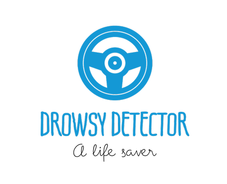

# <div align = "center">Drowsy-Detector</div>



## ShellHacks Competition


How to run for now:

1. If dependencies haven't been installed run:
```pip install -r requirements.txt```

2. run
```python VideoStreaming/main.py```


## Functions

### Step 1
```get_frame()```
'''
Uses camera to track the users eyes, in case user has eyes closed for more than 15 frames, send ```Alert```.
'''
### Step 2
```lat,long = DrowseyAlertMessage()```
'''
When Drowsey alert is recieved,get users current lat,long and go to step 2.
'''

### Step 3 
 ```places = google_maps(lat,long)``` 
 ''' Gets the users current-coodinates
 '''

### Step 4
 ```place = findKnearest(places)```
  '''
 Looks for the nearest ```rest_areas``` from the given lat,long coordinates and returns the closest one
 '''


